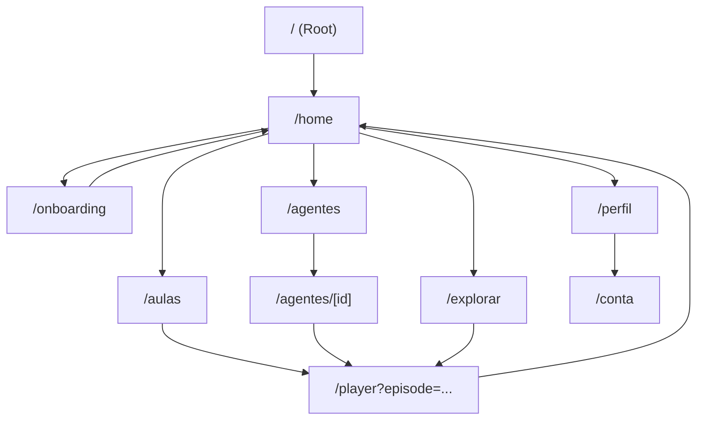

# Arquitetura de Informação (IA) — Fluxo educacional estilo Netflix

## 1) Objetivo
Definir a IA do produto **sem alterar rotas que já funcionam**, estruturando o aprendizado como “séries/temporadas/episódios” (catálogo → player → progresso) e usando linguagem/UX de streaming.

## 2) Modelo mental
- **Séries/Temporadas/Episódios** = trilhas/módulos curtos.
- **Agentes/Mentores** = guias por tema/estilo (motivação, lógica, etc.).
- **Continue assistindo** = retorno rápido ao último episódio.

## 3) Sitemap (preservando rotas)
### Núcleo (aparece no funil principal)
- "/home" — descoberta e retomada
- "/aulas" — catálogo estruturado (fases/temporadas)
- "/player" — consumo + interação + recompensa
- "/agentes" — catálogo de mentores
- "/agentes/[id]" — detalhe do mentor
- "/explorar" — biblioteca/descoberta ampla

### Acesso e conta
- "/onboarding" — configurar perfil/idade e preferências
- "/login" — autenticação
- "/perfil" / "/perfis" — identidade e seleção de perfil
- "/conta/*" — configurações e pagamentos
- "/planos" / "/sucesso" — conversão

## 4) Navegação global (desktop-first)
- Header fixo (marca + links principais)
- Itens recomendados:
  - Home ("Início") → "/home"
  - Aulas ("Temporadas") → "/aulas"
  - Explorar → "/explorar"
  - Agentes → "/agentes"
  - Perfil/Conta → "/perfil" e/ou "/conta"

## 5) Home — seções requeridas (mínimo viável)
> Baseado no que a Home atual já expressa.
1. **Hero/Billboard (destaque)**
   - Mensagem do produto + CTA principal (ex.: começar/onboarding)
   - CTA secundário (ex.: explorar mentores)
2. **Continue Assistindo**
   - Retomar último episódio (deep link para "/player?episode=..."), quando houver progresso.
3. **Fileiras temáticas (rows)**
   - Populares
   - Destaques da semana
   - Recomendados para você
   - (Opcional, se já houver dado): Minha lista
4. **CTA contextual (somente com rota válida)**
   - Ex.: “Entrar no Lab” → usar rota existente (ou ocultar até existir).

## 6) Fluxo principal (Netflix-style)
1. Você acessa "/" e cai em "/home".
2. Se onboarding for necessário, você é direcionado(a) para "/onboarding".
3. Na Home, você escolhe:
   - Retomar ("Continue assistindo") → "/player?episode=..."
   - Explorar catálogo estruturado → "/aulas"
   - Explorar mentores → "/agentes" / "/agentes/[id]"
4. No Player, você consome e interage (quiz/sincronia), gerando progresso.
5. Você retorna à Home ou ao Catálogo e vê progresso refletido.

## 7) Diagrama de navegação (Mermaid)

