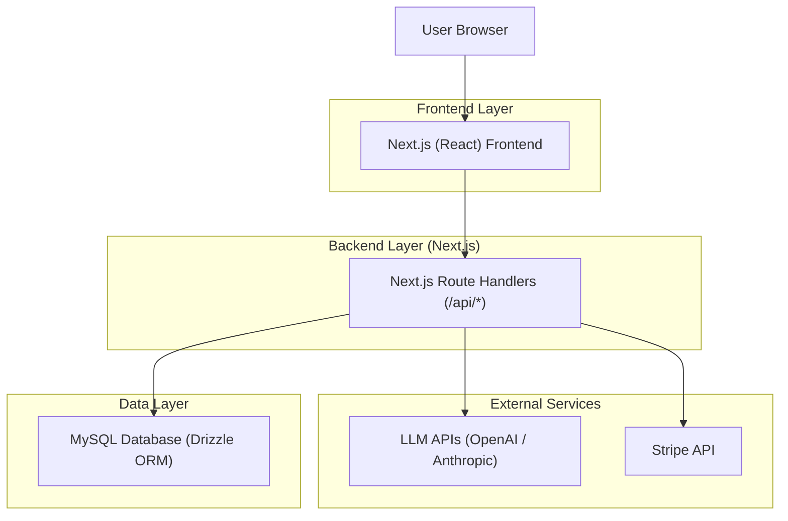
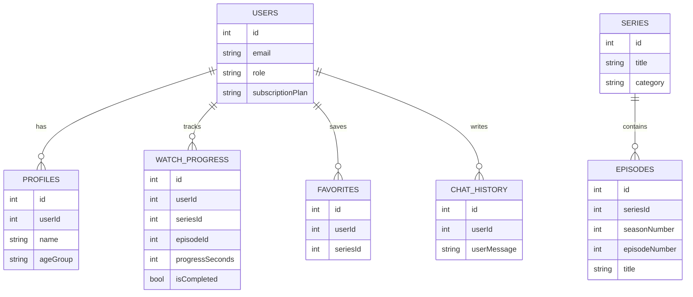

## 1.Architecture design

## 2.Technology Description
- Frontend: Next.js@16 + React@19 + TailwindCSS@4
- Backend: Next.js Route Handlers (App Router)
- Database: MySQL + drizzle-orm
- State/UI: Zustand + Framer Motion + Radix UI
- Payments: Stripe
- AI: OpenAI SDK + Anthropic SDK

## 3.Route definitions
| Route | Purpose |
|-------|---------|
| / | Redirecionar para /home |
| /home | Home estilo Netflix (descoberta + rows) |
| /aulas | Catálogo estruturado (fases/temporadas/episódios) |
| /player | Player do episódio (query: episode) |
| /explorar | Biblioteca/exploração |
| /agentes | Catálogo de mentores |
| /agentes/[id] | Detalhe do mentor |
| /onboarding | Gate/configuração inicial |
| /login | Autenticação |
| /perfil | Página de perfil |
| /conta | Hub de conta e subrotas |
| /planos | Página de planos |
| /sucesso | Pós-checkout |

## 4.API definitions
### 4.1 Core API (Route Handlers)
- POST /api/interaction: gerar perguntas/itens interativos para o player
- POST /api/chat: chat/assistência
- POST /api/voice/transcribe: transcrição de áudio
- POST /api/checkout: iniciar checkout
- POST /api/webhooks/stripe: webhook do Stripe
- POST /api/xp e /api/xp/events: eventos de XP/gamificação
- POST /api/lab/transformer: demo/experimentos

## 6.Data model(if applicable)
### 6.1 Data model definition

