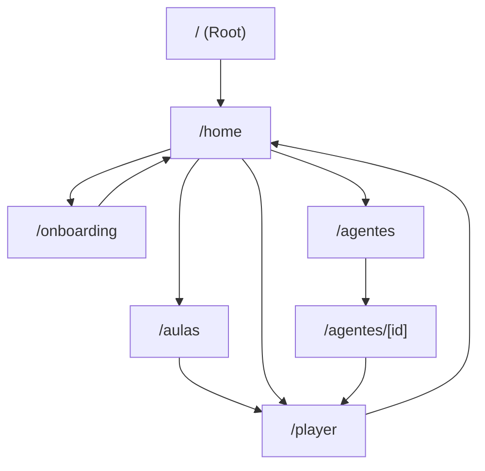

## 1. Product Overview
Plataforma educacional com UX de streaming: você aprende IA como “séries”, com temporadas curtas, mentores (agentes) e progresso contínuo.
Foco em descoberta rápida, retomada (“continue assistindo”) e consumo no player.

## 2. Core Features

### 2.1 User Roles
| Papel | Método de acesso | Permissões principais |
|------|-------------------|----------------------|
| Usuário | Login e/ou onboarding | Navegar catálogo, assistir no player, ver progresso |
| Admin (interno) | Acesso administrativo | Gerenciar dados/integrações (não detalhado no escopo) |

### 2.2 Feature Module
1. **Home (Início)**: hero/billboard, fileiras (populares/destaques/continue/recomendados), CTAs para aulas e agentes.
2. **Aulas (Catálogo)**: seleção de fase, lista de temporadas, cards de episódio com progresso e XP, link para player.
3. **Player**: reprodução, checkpoint/quiz (“sincronia”), salvar progresso, exibir dados do episódio.
4. **Agentes (Mentores)**: lista e detalhe do agente, link para conteúdos relacionados.
5. **Onboarding/Login**: iniciar sessão e definir preferências básicas antes de consumir conteúdo.
6. **Perfil/Conta**: ver/ajustar perfil e acessar configurações de conta.

### 2.3 Page Details
| Page Name | Module Name | Feature description |
|-----------|-------------|---------------------|
| Home ("/home") | Hero/Billboard | Exibir destaque principal e CTAs para onboarding/mentores/aulas. |
| Home ("/home") | Fileiras (Rows) | Listar categorias (populares, destaques, recomendados) com scroll horizontal e ação de abrir detalhe. |
| Home ("/home") | Continue assistindo | Retomar episódio baseado em progresso salvo e direcionar ao player. |
| Aulas ("/aulas") | Navegação por fase | Selecionar fase e listar temporadas disponíveis. |
| Aulas ("/aulas") | Grid de episódios | Exibir cards com tipo, duração, XP, agente e barra de progresso; abrir player com querystring. |
| Player ("/player") | Reprodução + estado | Tocar vídeo, registrar progresso, marcar conclusão ao final. |
| Player ("/player") | Interação/quiz | Pausar em checkpoint, mostrar pergunta/opções e retomar após confirmação/pulo. |
| Agentes ("/agentes") | Lista | Exibir catálogo de mentores e permitir abrir detalhe. |
| Agente detalhe ("/agentes/[id]") | Perfil do agente | Exibir informações do mentor e atalhos para conteúdos associados. |
| Onboarding ("/onboarding") | Configuração inicial | Coletar preferências básicas e liberar acesso às rotas principais. |
| Login ("/login") | Autenticação | Permitir entrada e redirecionar ao fluxo principal. |
| Perfil/Conta ("/perfil", "/conta") | Configurações | Exibir informações do usuário e links para ajustes (plano/segurança/pagamento). |

## 3. Core Process
### Fluxo principal (usuário)
1. Você acessa "/" e é redirecionado(a) para "/home".
2. Se necessário, você passa pelo "/onboarding" (gate) e volta para "/home".
3. Você escolhe um conteúdo via Home (rows/continue assistindo) ou via "/aulas".
4. Você assiste no "/player", interage no checkpoint e gera progresso.
5. Você retorna para "/home" e continua a jornada.

