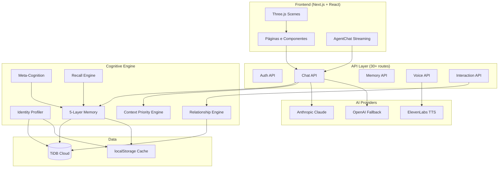
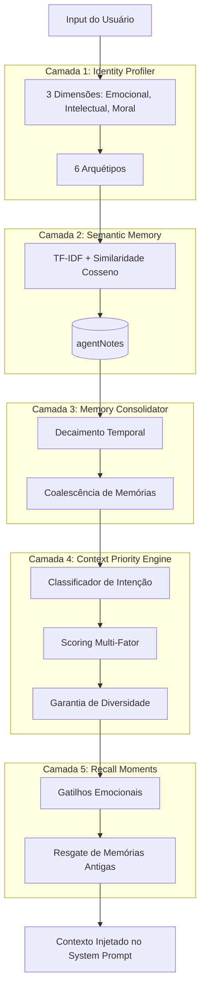
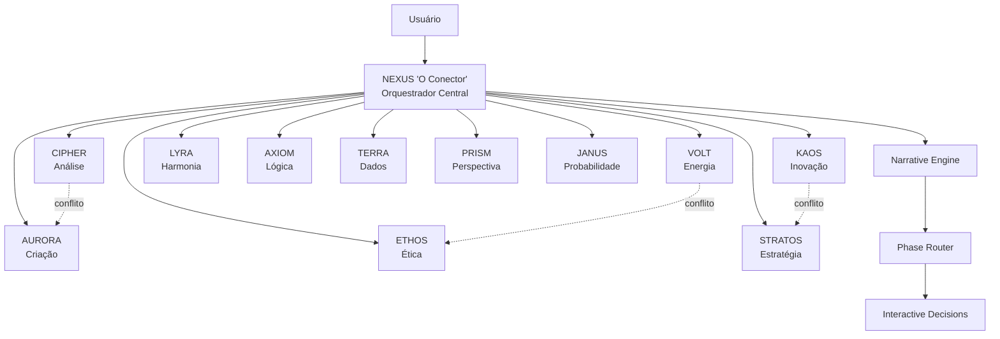
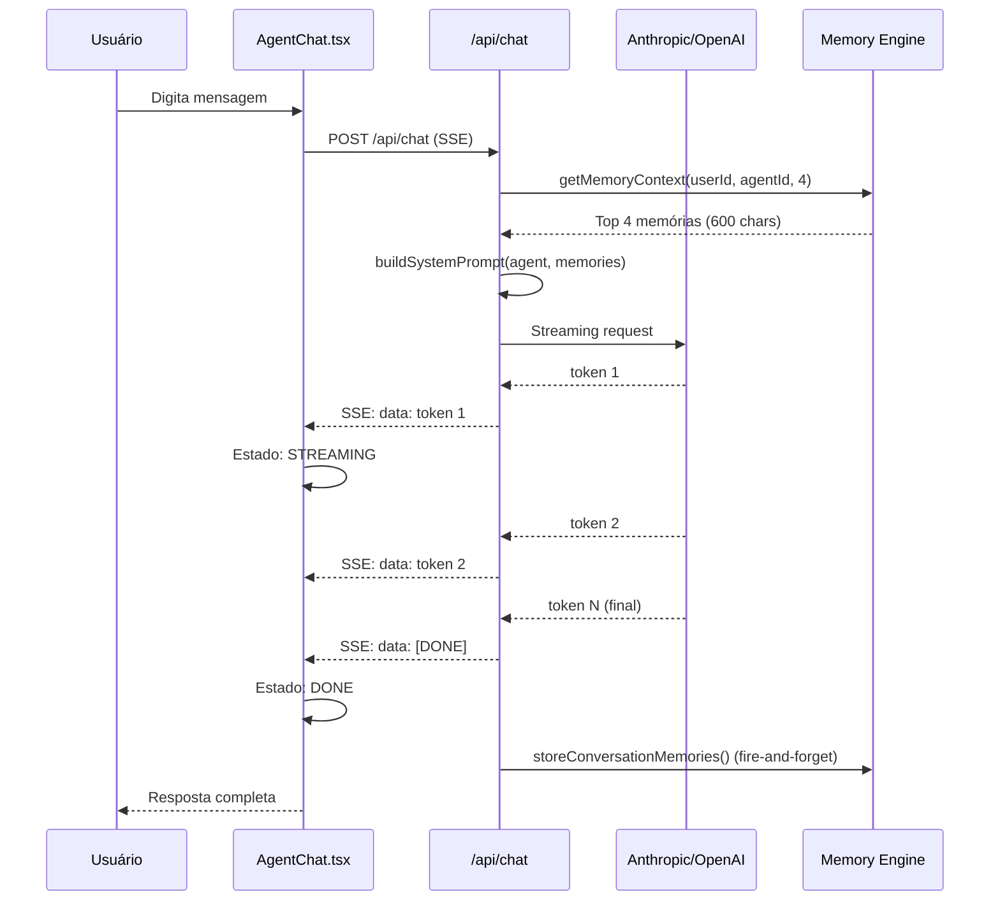
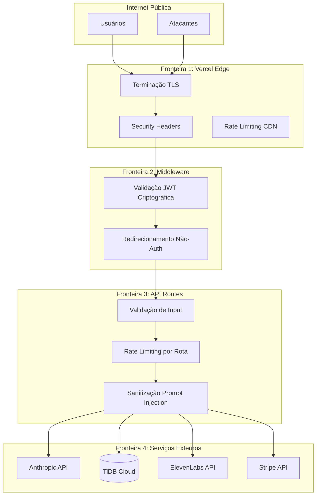
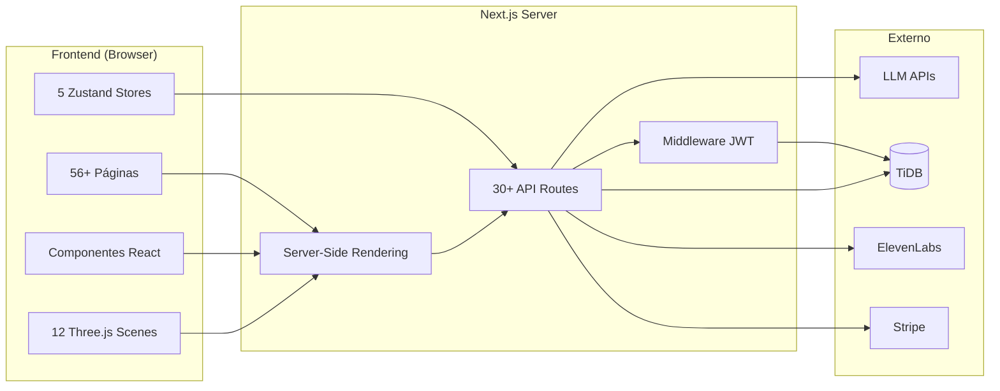
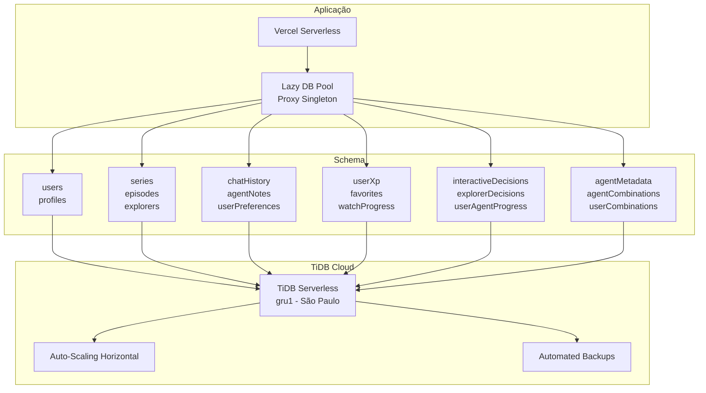
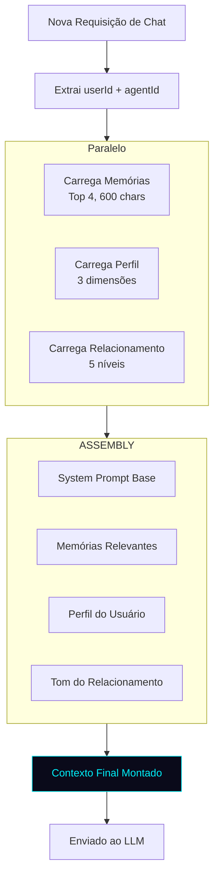

# 🗺️ Diagramas de Sistema — MENTE.AI

> **A planta baixa da civilização cognitiva.**  
> Diagramas de alto nível para orientação arquitetural.

---

## 1. ARQUITETURA COGNITIVA COMPLETA

---

## 2. CAMADAS DE MEMÓRIA

---

## 3. ORQUESTRAÇÃO DE AGENTES

---

## 4. ARQUITETURA DE STREAMING

---

## 5. LIMITES DE SEGURANÇA

---

## 6. RELAÇÃO FRONTEND ↔ BACKEND

---

## 7. ARQUITETURA DE BANCO DE DADOS

---

## 8. ORQUESTRAÇÃO DE CONTEXTO

---

> *"Um bom diagrama é como um mapa de metrô — não mostra cada árvore, mas mostra exatamente como chegar onde você precisa."*
