# MENTE.AI — Especificação Técnica da Stack

> **Documento:** `docs/stack-spec.md`  
> **Versão:** 1.0  
> **Data:** 2026-06-11  
> **Propósito:** Arquitetura, decisões técnicas, trade-offs e visão completa da plataforma

---

## Sumário

1. [Visão Geral do Produto](#1-visão-geral-do-produto)
2. [Stack Resumida](#2-stack-resumida)
3. [Framework & Runtime](#3-framework--runtime)
4. [Frontend — Estilização & UI](#4-frontend--estilização--ui)
5. [Frontend — 3D & Animações](#5-frontend--3d--animações)
6. [Estado & Stores](#6-estado--stores)
7. [Banco de Dados & ORM](#7-banco-de-dados--orm)
8. [Autenticação & Segurança](#8-autenticação--segurança)
9. [API & Server](#9-api--server)
10. [AI & LLMs](#10-ai--llms)
11. [Áudio & Voz](#11-áudio--voz)
12. [Pagamentos](#12-pagamentos)
13. [Design System](#13-design-system)
14. [Motor Cognitivo](#14-motor-cognitivo)
15. [Sistema de Gamificação](#15-sistema-de-gamificação)
16. [Motor de Narrativa Adaptativa](#16-motor-de-narrativa-adaptativa)
17. [Infraestrutura & Deploy](#17-infraestrutura--deploy)
18. [Serviços Externos](#18-serviços-externos)
19. [Testes & Qualidade](#19-testes--qualidade)
20. [Scripts & Automação](#20-scripts--automação)
21. [Diagramas de Arquitetura](#21-diagramas-de-arquitetura)
22. [Architecture Decision Records (ADRs)](#22-architecture-decision-records-adrs)
23. [Estrutura de Diretórios](#23-estrutura-de-diretórios)

---

## 1. Visão Geral do Produto

**MENTE.AI** é uma plataforma educacional brasileira que ensina Inteligência Artificial para não-técnicos através de experiências imersivas e gamificadas. O produto segue o conceito de **"Netflix do aprendizado de IA"**: 12 agentes (universos), 120 episódios, narrativa adaptativa e sistema de progressão com XP, streaks e badges.

**Público-alvo:** Iniciantes completos a avançados, com suporte a faixas etárias kids (4-12), teens (13-17) e adultos.

**Core feeling:** Belo, imersivo, motivador, acessível para iniciantes e poderoso para avançados.

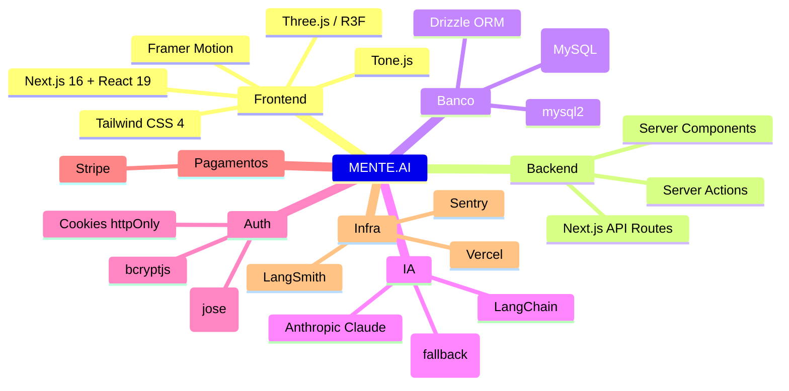

---

## 2. Stack Resumida

| Camada | Tecnologia | Versão |
|--------|-----------|--------|
| **Framework** | Next.js (App Router) | 16.2.6 |
| **Linguagem** | TypeScript | 5.9.3 |
| **Runtime** | Node.js | 20+ (Vercel) |
| **UI / Styling** | React + Tailwind CSS | React 19.2.4 / Tailwind 4 |
| **3D** | Three.js + @react-three/fiber | 0.183.2 / 9.5.0 |
| **Animação** | Framer Motion | 11.18.2 |
| **Estado** | Zustand | 5.0.12 |
| **ORM** | Drizzle ORM | 0.45.1 |
| **Banco** | TiDB Cloud (MySQL) | — |
| **Auth** | JWT (jose) + bcryptjs | jose 6.2.2 |
| **AI Primária** | Anthropic Claude | SDK 0.95.1 |
| **AI Fallback** | OpenAI | 4.77.0 |
| **Orquestração AI** | LangChain | 1.4.0 |
| **Pagamentos** | Stripe | 20.4.1 |
| **Áudio** | Tone.js, ElevenLabs API | Tone 15.1.22 |
| **Ícones** | Lucide React | 0.574.0 |
| **Componentes** | Radix UI | 1.4.3 |
| **Build** | Webpack (Turbopack quebra no WSL) | — |
| **Deploy** | Vercel | — |
| **Testes unitários** | Jest + ts-jest | 30.3.0 |
| **Testes E2E** | Playwright | 1.58.2 |
| **Monitoramento** | Sentry (opcional) + LangSmith | — |

---

## 3. Framework & Runtime

### Next.js 16 App Router

O projeto usa **Next.js 16 com App Router** (`/src/app`) — a arquitetura mais moderna do ecossistema React.

**Por que App Router:**
- Server Components por padrão (reduz JavaScript no cliente)
- Layouts aninhados com persistência de estado
- Streaming de UI via `loading.tsx`
- Server Actions para mutações sem API Routes
- Otimização automática de metadados e imagens

**Estrutura de rotas:**

```
src/app/
  page.tsx                    # Landing page (pública)
  layout.tsx                  # Root layout (globals.css + GamificationWrapper)
  (main)/                     # Rotas protegidas (autenticadas)
    layout.tsx                # Layout principal com Header/Navigation
    home/                     # Dashboard pós-login
    explorar/                 # Catálogo de agentes
    aulas/                    # Conteúdo educacional
    agentes/[id]/             # Perfil de cada agente
    lab/                      # Laboratório interativo
    player/                   # Player de episódios
    universo/                 # Universo narrativo (12 agentes)
    perfil/                   # Perfil do usuário
    login/                    # Login (página, não rota de API)
  api/                        # API Routes
    auth/                     # Login, logout, register, session
    chat/                     # Chat com agentes
    xp/                       # XP e gamificação
    stripe/                   # Webhooks e checkout
    ...
```

### TypeScript 5.9

Configuração estrita (`strict: true`) com paths `@/*` mapeando para `./src/*`.

**Compilador:** `target: ES2022`, `moduleResolution: bundler`, `jsx: react-jsx`.

---

## 4. Frontend — Estilização & UI

### Tailwind CSS 4

O projeto foi migrado para **Tailwind CSS 4** usando o novo PostCSS plugin `@tailwindcss/postcss` e `@theme` para design tokens.

```css
/* globals.css */
@import "tailwindcss";

@theme {
  --color-cyber-black: #0a0a1a;
  --color-neon-cyan: #00f0ff;
  --color-neon-purple: #a855f7;
  --font-display: "Space Grotesk", system-ui, sans-serif;
  --radius-card: 10px;
}
```

**Tema escuro cyberpunk:**
- Background: `#0a0a1a` (cyber-black)
- Neons: cyan, purple, pink, blue, orange, green
- Glassmorphism: `backdrop-filter: blur(16px)` com bordas sutis
- Efeitos: `glow-cyan`, `glow-purple`, `card-shine`, `shimmer`

### Radix UI

Componentes acessíveis e sem estilo (`shadcn` presente nas devDependencies). Usado para modais, dropdowns, tabs e outros primitivos de UI.

### Lucide React

Pacote de ícones para toda a interface. Versão 0.574.0.

### Fonte: Space Grotesk

Fonte display carregada via Next.js font optimization (`next/font/google`), com fallback para system-ui.

---

## 5. Frontend — 3D & Animações

### Three.js + React Three Fiber

Cada um dos 12 agentes tem uma **cena 3D própria** em `src/components/scenes/`:

| Agente | Componente | Tema Visual |
|--------|-----------|-------------|
| NEXUS | NexusScene | Conexão neural, pulsos roxos |
| VOLT | VoltScene | Raios, energia amarela |
| AURORA | AuroraScene | Aurora boreal ciano |
| KAOS | KaosScene | Caos vermelho |
| CIPHER | CipherScene | Código verde |
| LYRA | LyraScene | Música violeta |
| ETHOS | EthosScene | Bronze, sabedoria |
| AXIOM | AxiomScene | Ciência azul |
| STRATOS | StratosScene | Estratégia prata |
| TERRA | TerraScene | Natureza verde |
| PRISM | PrismScene | Arco-íris rosa |
| JANUS | JanusScene | Dualidade laranja |

Usa `@react-three/postprocessing` para efeitos de pós-processamento.

### Framer Motion 11

Animações declarativas em toda a UI. Padrão: 0.3-0.4s com `easeOut`.

**Sistema de Motion Tokens** em `src/design-system/motion.ts`:
- `duration.scan` = 800ms (escaneamento)
- `duration.synthesis` = 1200ms (processamento)
- `duration.leap` = 600ms (transições)
- `duration.pulse` = 2000ms (descobertas)
- `duration.echo` = 400ms (memória)

Com suporte a `prefers-reduced-motion` (colapsa para 0ms).

---

## 6. Estado & Stores

### Zustand 5

Gerenciamento de estado global leve com persistência em `localStorage`.

**Stores principais:**

| Store | Propósito |
|-------|-----------|
| `useAppStore` | Estado global: agente guia, zona ativa, diálogo NEXUS, perfil, LOGOS |
| `useUserStore` | Dados do usuário logado |
| `useNavigationStore` | Estado de navegação e rotas |
| `useLabStore` | Estado do laboratório interativo |
| `useNexusStore` | Estado do universo NEXUS |
| `useUniverseStore` | Estado dos universos/planetas |
| `useCognitiveStore` | Estado cognitivo (emoções, atenção) |

**Persistência:** `useAppStore` usa `zustand/middleware/persist` com `createJSONStorage(() => localStorage)`. Armazena: guia, zona, partículas, intro, áudio, perfil e mensagens.

---

## 7. Banco de Dados & ORM

### Drizzle ORM 0.45 + mysql2 3.18

**Decisão crítica: Drizzle é o ÚNICO ORM permitido. Prisma é proibido.**

**Por que Drizzle em vez de Prisma:**
- Lightweight (sem engine binária)
- SQL-like (mais controle sobre queries)
- Performance superior em serverless
- Melhor suporte a MySQL/TiDB
- Tipagem mais previsível

### Database: TiDB Cloud (MySQL)

Banco de dados MySQL compatível com TiDB Cloud (distribuído, elástico). Conexão via `mysql2/promise` com pool de 5 conexões, SSL habilitado.

```typescript
// src/lib/db/index.ts
const pool = mysql.createPool({
  host: parsed.hostname,
  port: parseInt(parsed.port || "4000"),
  user: parsed.username,
  password: decodeURIComponent(parsed.password),
  database: parsed.pathname.replace("/", ""),
  ssl: { rejectUnauthorized: true },
  connectionLimit: 5,
  queueLimit: 0,
});
```

**Proxy lazy:** `db` é um Proxy que cria a instância Drizzle sob demanda (lazy loading) — ideal para serverless evitar conexões em cold start.

### Schema — Principais Tabelas

| Tabela | Propósito |
|--------|-----------|
| `users` | Usuários, auth, planos de assinatura |
| `profiles` | Perfis por usuário (avatar, aura, faixa etária) |
| `series` | Séries de conteúdo educacional |
| `episodes` | Episódios de cada série |
| `chatHistory` | Histórico de chats com agentes |
| `watchProgress` | Progresso de visualização |
| `favorites` | Lista de favoritos |
| `userPreferences` | Preferências (tema, idioma, notificações) |
| `explorers` | Exploradores (versão antiga do onboarding) |
| `userXp` | XP total, semanal, streaks |
| `agentMetadata` | Metadados de gamificação dos 12 agentes |
| `userAgentProgress` | Progresso do usuário com cada agente |
| `agentCombinations` | Combinações de agentes (sinergias) |
| `userCombinations` | Combinações descobertas pelo usuário |
| `agentMemories` | Memória persistente multi-agente |
| `universeProgression` | Progressão no universo narrativo |
| `knowledgeUnit` | Átomos de conhecimento (pedagogia) |
| `knowledgeAsset` | Assets de conhecimento (vídeo, quiz, áudio) |
| `knowledgeGraphEdge` | Grafo de dependências entre conhecimentos |
| `xpEvents` | Eventos de XP (para auditoria) |
| `referrals` | Sistema de indicação |
| `rewards` | Recompensas |
| `fraudLog` | Log de anti-fraude |
| `contentMetadata` | Metadados para personalização Netflix-like |
| `thumbnailVariants` | Variantes de thumbnail para A/B testing |
| `abTestExperiments` | Experimentos A/B |
| `userInteractions` | Rastreamento de interações |
| `blogPosts` | Blog educacional |
| `parentControls` | Controles parentais |
| `userProfile` | Perfil narrativo (dimensões emocionais) |
| `narrativeDecisions` | Decisões narrativas do usuário |
| `universeTransitions` | Transições entre universos |
| `logosAttempts` | Tentativas do LOGOS gate |
| `universePresence` | Presença em tempo real por universo |

### Migrações

Drizzle Kit gera migrações SQL em `/drizzle/`. Aplicadas via `drizzle-kit push` ou scripts custom.

---

## 8. Autenticação & Segurança

### JWT + Cookies HttpOnly

**Stack:** `jose` 6.2.2 (JWT signing/verification) + `bcryptjs` 2.4.3 (senhas)

**Fluxo de autenticação:**

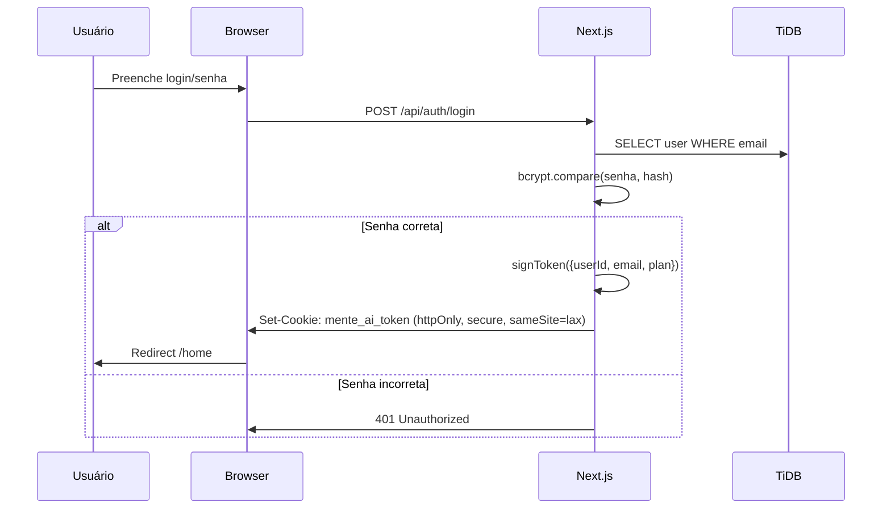

**Cookie:** Nome `mente_ai_token` (hardcoded — NÃO NEGOCIÁVEL), httpOnly, secure em produção, sameSite lax, expira em 7 dias.

**Middleware** (`src/middleware.ts`): Verifica o JWT em todas as rotas protegidas. Se inválido/expirado → redirect `/login`. Se rota raiz `/` com token válido → redirect `/home`.

**Rotas protegidas:** `/home`, `/lab`, `/universo`, `/dashboard`, `/aulas`, `/perfil`, `/conta`, `/player`, `/explorar`, `/agentes`, `/avatar`, `/sentinel`.

### Senhas

bcryptjs com hash e comparação. Armazenadas na coluna `password` da tabela `users`.

### FingerprintJS

`@fingerprintjs/fingerprintjs` 5.2.0 para detecção de fraude em cadastros e indicações.

---

## 9. API & Server

### Next.js API Routes (Route Handlers)

Todas as APIs em `src/app/api/`:

| Rota | Método | Propósito |
|------|--------|-----------|
| `/api/auth/login` | POST | Login |
| `/api/auth/register` | POST | Cadastro |
| `/api/auth/logout` | POST | Logout |
| `/api/auth/session` | GET | Sessão atual |
| `/api/chat` | POST | Chat com agentes |
| `/api/elevenlabs/speak` | POST | TTS |
| `/api/xp/award` | POST | Premiar XP |
| `/api/xp/events` | GET | SSE de XP em tempo real |
| `/api/ranking` | GET | Ranking de usuários |
| `/api/checkout` | POST | Stripe checkout |
| `/api/webhooks/stripe` | POST | Webhook Stripe |
| `/api/presence` | POST | Presença em tempo real |
| `/api/universe/progression` | GET/POST | Progressão no universo |
| `/api/narrative/suggest` | GET | Sugestões narrativas |
| `/api/health/*` | GET | Health checks |
| `/api/admin/dashboard` | GET | Admin dashboard |

### Streaming

XP em tempo real via **Server-Sent Events (SSE)** em `/api/xp/events`. Reconexão automática via `EventSource` nativo do browser.

### WebSocket

WebSocket para sincronização runtime em `/api/ws/runtime-sync`.

---

## 10. AI & LLMs

### Provedor Primário: Anthropic Claude

**SDK:** `@anthropic-ai/sdk` 0.95.1  
**Modelo padrão:** `claude-haiku-4-5-20251001`  
**Timeout:** 25s por chamada  
**Retry:** 2 tentativas com backoff exponencial (800ms → 1600ms)

**Funcionalidades:**
- `anthropicCompletionText()` — chamada não-streaming com retry
- `anthropicFetchDireto()` — fallback usando fetch nativo (sem SDK)
- `anthropicStream()` — streaming para chat em tempo real

**Classificação de erros:** sem_chave, dns, timeout, autorizacao, rate_limit, servidor, desconhecido. Retry apenas para erros transitórios.

### Provedor Secundário: OpenAI

**SDK:** `openai` 4.77.0  
Usado como fallback quando Anthropic falha.

### LangChain

Orquestração de chains multi-agente. Usa `@langchain/core` 1.1.46 e `@langchain/openai` 1.4.5.

### Cache Inteligente

`src/lib/smart-cache.ts`: Cache de respostas pré-construídas (`prebuilt-cache.json`). Suporta:
- Match exato (após normalização: lowercase, sem acentos, sem pontuação)
- Fuzzy match (similaridade por palavras compartilhadas, threshold 0.5)

### LangSmith Tracing

Rastreamento de chamadas LLM com LangSmith. Habilitado via env vars `LANGSMITH_API_KEY`, `LANGSMITH_PROJECT`, `LANGSMITH_TRACING=true`. Inicialização segura (não quebra se chave ausente).

### Nano Banana AI

Geração de imagens via Nano Banana API (serviço externo). Configurado em `src/lib/nano-banana.ts` com timeout de 60s.

---

## 11. Áudio & Voz

### Tone.js 15.1

Síntese de áudio em tempo real para:
- Áudio ambiente nos universos (`ambientEngine.ts`)
- Efeitos sonoros de UI (hover, descobertas, XP)
- Resposta emocional adaptativa

### ElevenLabs API

Text-to-Speech de alta qualidade para narração dos agentes. Rota: `/api/elevenlabs/speak`.

### Web Speech API

Fallback nativo do browser para TTS quando ElevenLabs não está disponível.

### Fluxo de Áudio

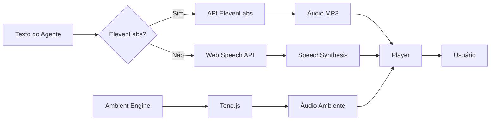

---

## 12. Pagamentos

### Stripe 20.4.1

Integração completa com Stripe para:
- Checkout (`/api/checkout`)
- Webhooks (`/api/webhooks/stripe`)
- Portal de assinatura (`/conta/assinatura`)
- Histórico de pagamentos

**Planos:** FREE, BASIC, PREMIUM, FAMILY. Armazenados em `users.subscriptionPlan`.

**Stripe Customer:** Vinculado via `users.stripeCustomerId`.

---

## 13. Design System

### Sistema de 4 camadas

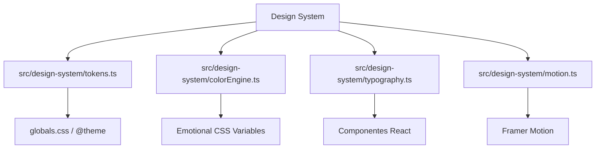

### Tokens Semânticos (`tokens.ts`)

Cada token carrega significado cognitivo — NADA é genérico:

| Categoria | Exemplos |
|-----------|----------|
| `color.system` | idle, scanning, processing, synthesis, complete, error |
| `color.discovery` | tier1 (purple), tier2, tier3 |
| `color.access` | surface (slate), deep (cyan), core (purple), restricted (red) |
| `color.danger` | low (amber), elevated (orange), critical (red) |
| `color.signal` | weak, moderate, strong, urgent, lost |
| `color.surface` | background, panel, border, overlay |
| `color.text` | primary, secondary, link, danger, success |
| `spacing` | micro(4px) até section(96px) |
| `radius` | none(0px), minimal(2px), card(4px), panel(6px) — NADA arredondado |
| `shadow` | subtle, elevated, modal, glowCyan, glowPurple |
| `zIndex` | base(0) até notification(60) |
| `animation` | instant(100ms) até beacon(1200ms) |

### Color Engine (`colorEngine.ts`)

Mapeia 5 estados emocionais de UI para paletas CSS:

| Emoção | Cor Base | Accent | Glow |
|--------|---------|--------|------|
| curious | `#001422` | `#00D9FF` | rgba(0,217,255,0.25) |
| enthusiastic | `#001A10` | `#10B981` | rgba(16,185,129,0.25) |
| thoughtful | `#1A1000` | `#F59E0B` | rgba(245,158,11,0.25) |
| frustrated | `#1A0800` | `#EA580C` | rgba(234,88,12,0.25) |
| calm | `#0A1018` | `#64748B` | rgba(100,116,139,0.20) |
| neutral | `#0a0a1a` | `#00FFFF` | rgba(0,255,255,0.15) |

Aplica CSS custom properties via `applyEmotionPalette()` com transições de 1200ms.

### Tipografia (`typography.ts`)

Sistema temático com nomenclatura sci-fi:

| Nível | Clearance | Uso | Tamanho |
|-------|-----------|-----|---------|
| broadcast | SUPERFÍCIE | Títulos, headers, nomes | clamp(1.5rem, 4vw, 2.5rem) |
| operational | OPERACIONAL | Corpo de texto | 1rem |
| classified | PROFUNDO | Rótulos, tags | 0.9375rem |
| restricted | RESTRITO | Alertas críticos | 0.6875rem |

Fontes: Space Grotesk (display), Plus Jakarta Sans (body), JetBrains Mono (mono).

---

## 14. Motor Cognitivo

### Arquitetura

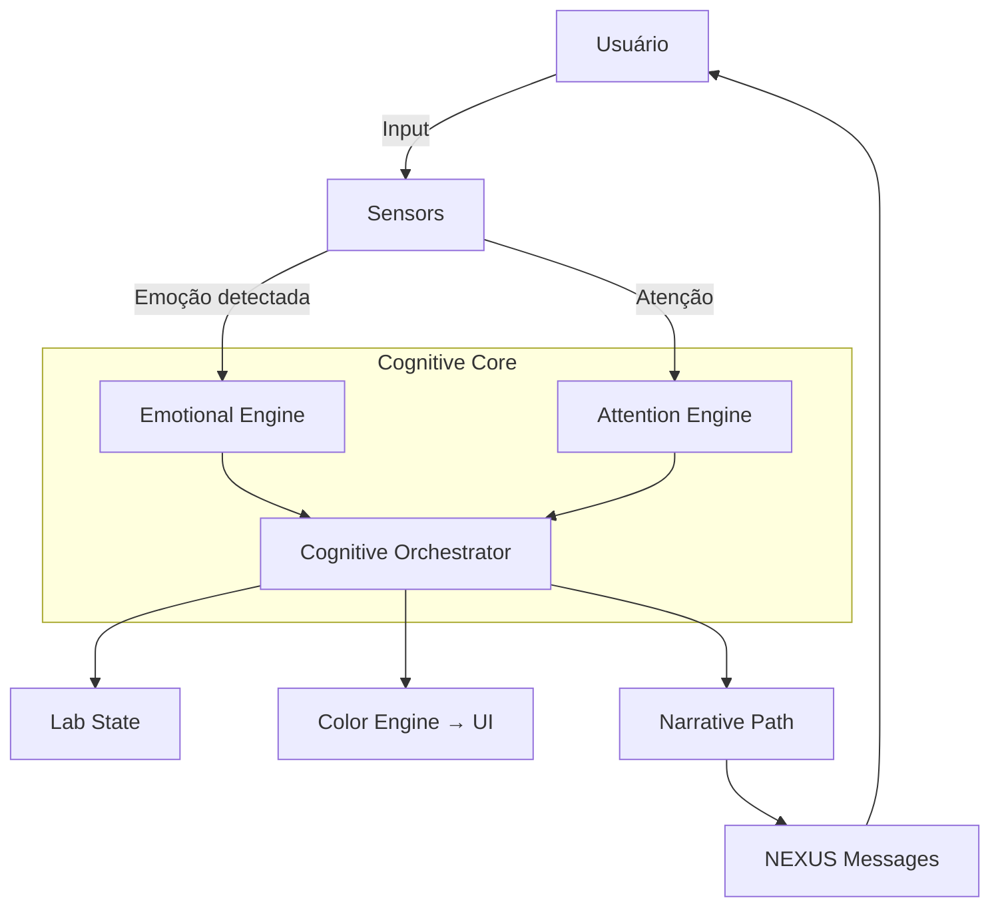

### Componentes do Motor Cognitivo

| Componente | Arquivo | Função |
|-----------|---------|--------|
| Emotional Engine | `src/cognitive/core/emotionalEngine.ts` | 8 emoções: curiosity, joy, surprise, fear, sadness, anger, disgust, neutral |
| Attention Engine | `src/cognitive/core/attentionEngine.ts` | Foco e atenção do usuário |
| Cognitive Orchestrator | `src/cognitive/core/cognitiveOrchestrator.ts` | Orquestra todos os subsistemas cognitivos |
| Emotion Sensor | `src/cognitive/sensors/emotionSensor.ts` | Detecta emoção do texto do usuário |
| Lab State | `src/cognitive/core/labState.ts` | Estado do laboratório cognitivo |

---

## 15. Sistema de Gamificação

### Mecânicas

| Mecânica | Implementação | Detalhes |
|----------|--------------|----------|
| **XP** | `src/lib/xp-engine.ts`, `src/lib/xp.ts` | XP por ações: episódio (10), lab (15), login (5), combo (50) |
| **Streak** | `userXp.streakDays` | Sequência de dias consecutivos |
| **Níveis** | `REWARD_LEVELS` (5 níveis) | Explorador Iniciante → Lenda Viva |
| **Badges** | `badges.ts` | Conquistas desbloqueáveis |
| **Combinações** | `agentCombinations` | 4 tipos de sinergia entre agentes |
| **Ranking** | `/api/ranking` | Leaderboard global |
| **Progresso por Agente** | `userAgentProgress` | Nível de relacionamento 0-5 |

### Regras de XP

```typescript
export const XP = {
  EPISODE_COMPLETE: 10,
  ALL_CHOICES_MADE: 5,
  FIRST_EPISODE_DAY: 2,
  LAB_EXPERIMENT: 15,
  LAB_ROLLBACK_BONUS: 5,
  DAILY_CEILING: 100,        // Cap diário de XP
} as const;

export const XP_REWARDS = {
  NOTA_CRIADA:          10,
  EXPERIMENTO_CONCLUIDO: 25,
  LOGIN_DIARIO:          5,
  AGENTE_DESBLOQUEADO:   30,
  AGENTE_INTERACAO:      15,
  AGENTE_COMPLETADO:     100,
  COMBINACAO_DESCOBERTA: 50,
  COMBINACAO_USADA:      10,
} as const;
```

### Anti-Fraude

- Cap diário de XP (100)
- Verificação de fingerprint (FingerprintJS)
- Log de fraudes (`fraudLog`)
- Validação de indicações (IP, fingerprint, data)

---

## 16. Motor de Narrativa Adaptativa

### Arquitetura

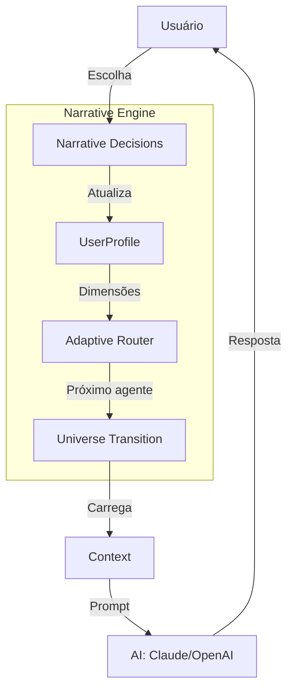

### Dimensões do Perfil Narrativo

| Dimensão | Faixa | Descrição |
|----------|-------|-----------|
| `emotionalDim` | 0.0 - 1.0 | curiosidade → medo → rebeldia → empatia |
| `intellectualDim` | 0.0 - 1.0 | lógico → intuitivo |
| `moralDim` | 0.0 - 1.0 | proteger humanidade → expandir IA |

### Adaptive Router

O roteador adaptativo (`src/engine/adaptive-router.ts`) decide:
- Qual agente/universe apresentar a seguir
- Quando mudar de universo (após estagnação)
- Qual tom narrativo usar baseado no perfil

### Transições Narrativas

Registradas em `universeTransitions`. Motivos: `stagnation`, `router_decision`, `user_choice`.

---

## 17. Infraestrutura & Deploy

### Plataforma: Vercel

Deploy contínuo via integração com GitHub. Branch `main` → produção.

### Build

**Contexto crítico:** Turbopack quebra com lockfile cross-platform no WSL. **Usar Webpack obrigatoriamente.**

```bash
npm run dev          # Next.js dev (Webpack via --webpack flag)
npm run build        # Build de produção
npm run start        # Produção standalone
```

**Validator:** `npm run quality` roda lint + typecheck + tests.

### Variáveis de Ambiente

| Variável | Propósito | Obrigatória |
|----------|-----------|:-----------:|
| `DATABASE_URL` | Conexão TiDB (MySQL) | ✅ |
| `JWT_SECRET` | Chave para assinar JWT | ✅ |
| `ANTHROPIC_API_KEY` | API Key Anthropic | ✅ |
| `OPENAI_API_KEY` | API Key OpenAI | ✅ |
| `STRIPE_SECRET_KEY` | Chave secreta Stripe | ⚠️ |
| `NEXT_PUBLIC_STRIPE_PUBLISHABLE_KEY` | Chave pública Stripe | ⚠️ |
| `STRIPE_WEBHOOK_SECRET` | Segredo do webhook Stripe | ⚠️ |
| `ELEVENLABS_API_KEY` | API Key ElevenLabs | ❌ |
| `LANGSMITH_API_KEY` | Tracing LangSmith | ❌ |
| `SENTRY_DSN` | DSN do Sentry | ❌ |
| `NANO_BANANA_API_KEY` | Geração de imagens | ❌ |
| `NEXT_PUBLIC_SITE_URL` | URL do site (SEO) | ❌ |

### CI/CD (Playwright)

Playwright configurado para CI:
- 2 retries em CI
- 1 worker em CI
- Web server: `node .next/standalone/server.js`
- Browsers: Chromium + Firefox

### Arquivos de Deploy

- `robots.txt` e `sitemap.ts` para SEO
- Google Search Console verificado
- Open Graph + Twitter Cards configurados

---

## 18. Serviços Externos

| Serviço | Uso | Custo Estimado | Plano Atual |
|---------|-----|---------------|-------------|
| **Anthropic (Claude)** | Chat com agentes, geração de conteúdo | $/token | Haiku (baixo custo) |
| **OpenAI** | Fallback do Claude | $/token | Pay-as-you-go |
| **TiDB Cloud** | Banco de dados MySQL | ~$50-200/mês | Tier serverless |
| **Stripe** | Pagamentos e assinaturas | 2.9% + $0.30/trans | Standard |
| **ElevenLabs** | Text-to-Speech | ~$5-100/mês | Creator/Pro |
| **LangSmith** | Tracing de LLMs | Grátis (uso moderado) | Developer |
| **Sentry** | Monitoramento de erros | Grátis (5k events/mês) | Developer |
| **FingerprintJS** | Anti-fraude | Grátis (20k visits/mês) | Pro Trial |
| **Nano Banana AI** | Geração de imagens | ~$0.01-0.05/imagem | Pay-as-you-go |
| **Vercel** | Hosting + deploy | Grátis (Hobby) | Pro ($20/mês) |
| **Google Search Console** | SEO | Grátis | — |

---

## 19. Testes & Qualidade

### Estratégia

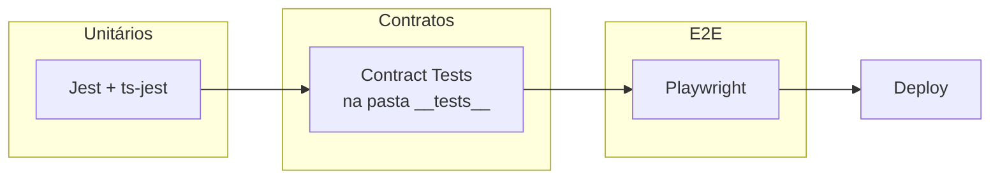

### Jest 30 + ts-jest 29

- **Environment:** jsdom (para componentes React)
- **Setup:** `jest.setup.js` com `@testing-library/jest-dom`
- **Mocks:** `server-only` mock em `__mocks__/server-only.ts`
- **Cobertura:** `npm run test:coverage`

**Testes existentes:**
- `src/__tests__/agents.test.ts`
- `src/__tests__/cognitive/agent-identity.test.ts`
- `src/lib/__tests__/gamification-logger.test.ts`
- `src/lib/__tests__/xp.test.ts`
- `src/services/__tests__/agent-combination.test.ts`
- `src/components/hud/__tests__/` (testes de contrato para PulseBeacon, ScannerRing, etc.)
- `src/components/motion/__tests__/` (testes de contrato para DeepScan, EchoPulse, etc.)

### Playwright 1.58

- **Testes E2E:** `tests/e2e/`
- **Navegadores:** Chromium + Firefox
- **Gravador de demo:** `npm run demo:record`
- **Relatório:** HTML (`playwright-report/`)

### Testes de Contrato

Presentes em vários componentes com padrão `*.contract.test.ts`. Verificam:
- Contratos de props
- Estados (loading, erro, vazio)
- Comportamento esperado

### Quality Gate

```bash
npm run quality   # lint + typecheck + tests
```

---

## 20. Scripts & Automação

O projeto tem 32+ scripts em `scripts/`:

| Script | Propósito |
|--------|-----------|
| `clean-dev.ps1` | Limpa cache Next.js para dev |
| `commit-all.ps1` | Commit automatizado |
| `quick-commit.ps1` | Commit rápido |
| `automate-everything.ts` | Automação completa |
| `generate-agents.ts` | Geração de agentes |
| `generate-agent-images.ts` | Geração de imagens |
| `generate-page-audios.mjs` | Geração de áudios |
| `seed-knowledge-model.ts` | Seed do modelo de conhecimento |
| `drizzle-push-patched.js` | Push Drizzle com patch |
| `apply-migration.js` | Aplicar migração |
| `migrate-*.js` | Migrações diversas |
| `audit_db.mjs` | Auditoria do banco |
| `team-manager.ps1` | Gerenciamento de equipe |
| `export-prompts.ts` | Exportar prompts |
| `validate-docs.py` | Validação de documentação |
| `drop-ab-test.js` | Limpeza de A/B tests |

---

## 21. Diagramas de Arquitetura

### Arquitetura Geral

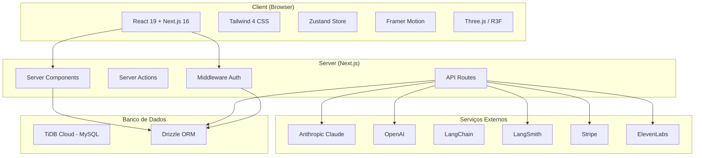

### Fluxo de Dados — Chat com Agente

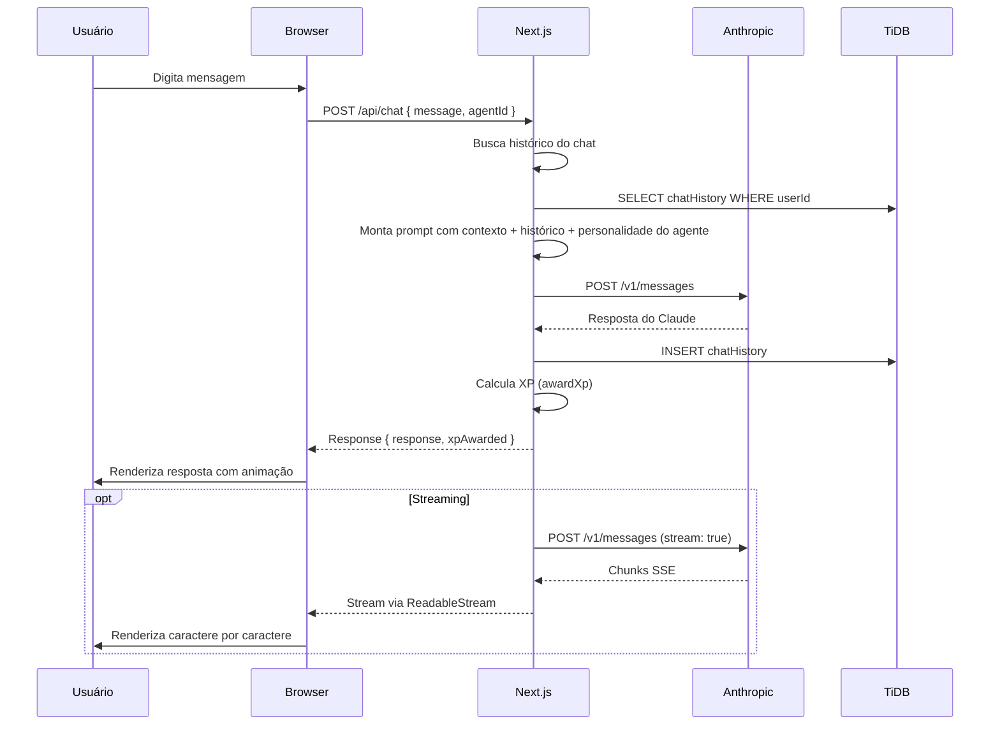

### Fluxo de Gamificação

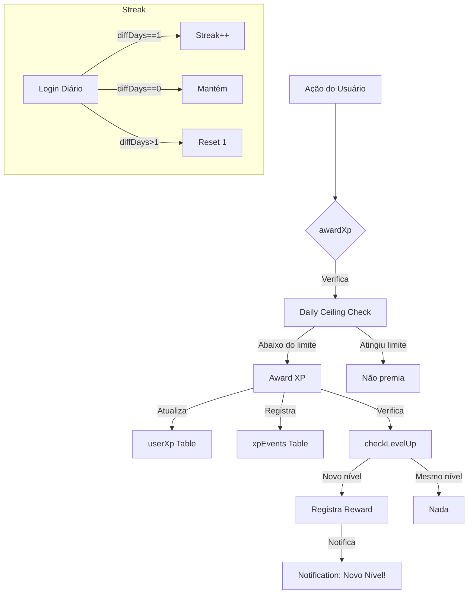

### Fluxo de Autenticação

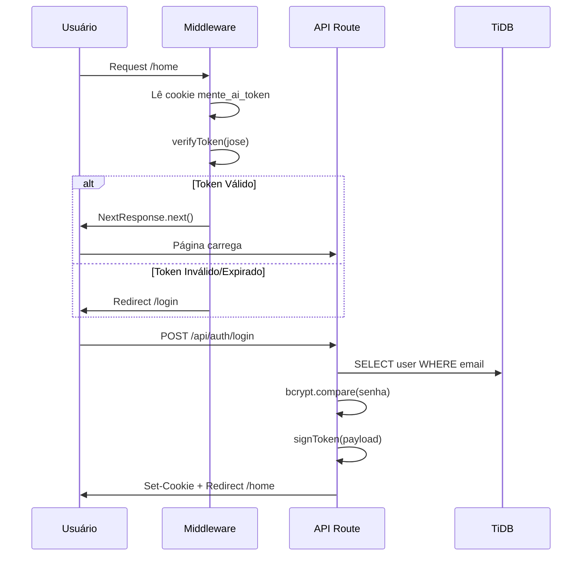

---

## 22. Architecture Decision Records (ADRs)

### ADR-001: Drizzle ORM em vez de Prisma

**Contexto:** Prisma é o ORM mais popular do ecossistema Next.js.

**Decisão:** Usar Drizzle ORM.

**Alternativas consideradas:**
- **Prisma:** Engine binária pesada, performance subótima em serverless, esquema não é SQL puro
- **Knex:** Muito verboso, sem tipos fortes
- **TypeORM:** Anotações decorator, complexidade desnecessária
- **Raw SQL:** Sem segurança de tipos

**Motivo:** Drizzle é:
- Zero engine binária (leve)
- SQL-like (fácil de debugar)
- Performance superior em cold start serverless
- Tipagem mais previsível que Prisma
- Melhor integração com TiDB

**Consequências:**
- Migrações manuais via Drizzle Kit
- Equipe precisa conhecer SQL

### ADR-002: JWT + Cookies em vez de NextAuth.js

**Contexto:** NextAuth.js (Auth.js) é o padrão recomendado para Next.js.

**Decisão:** Implementar auth custom com JWT + cookies httpOnly.

**Alternativas:**
- **NextAuth.js:** Complexidade adicional, overhead para um caso de uso simples
- **Clerk:** Serviço pago, vendor lock-in
- **Supabase Auth:** Dependência externa

**Motivo:**
- Controle total sobre o fluxo de auth
- Sem dependências externas para um recurso crítico
- JWT stateless (sem session store)
- Cookie name `mente_ai_token` é hardcoded e imutável

**Consequências:**
- Implementação manual de reset de senha, refresh token, etc.
- JWT tem 7 dias de expiração (sem refresh automático)

### ADR-003: TiDB Cloud em vez de PostgreSQL (Supabase/Neon)

**Contexto:** TiDB Cloud é um banco MySQL compatível, menos comum que PostgreSQL no ecossistema Next.js.

**Decisão:** TiDB Cloud (MySQL).

**Alternativas:**
- **Supabase:** PostgreSQL + serviços extras, mas maior custo e lock-in
- **Neon:** PostgreSQL serverless, excelente, mas mais caro em escala
- **PlanetScale:** MySQL serverless, descontinuou plano grátis

**Motivo:**
- TiDB é distribuído (escala horizontal automática)
- Elástico (paga pelo que usa)
- Compatível com MySQL (ecossistema maduro)
- Conexão SSL nativa

**Consequências:**
- Sem features avançadas do PostgreSQL (arrays nativos, enum types, etc.)
- Drizzle precisa do dialect MySQL

### ADR-004: Anthropic Claude como AI Primária

**Contexto:** Múltiplos provedores de LLM disponíveis.

**Decisão:** Anthropic Claude como provedor primário, OpenAI como fallback.

**Alternativas:**
- **OpenAI GPT-4:** Mais caro, menos seguro para conteúdo educacional infantil
- **Google Gemini:** API menos estável
- **Groq:** Extremamente rápido, mas modelos menores
- **DeepSeek:** Alternativa chinesa, latência variável

**Motivo:**
- Claude é superior em segurança e alinhamento (crucial para público infantojuvenil)
- Haiku é o melhor custo-benefício para tarefas educacionais
- Política de segurança da Anthropic mais adequada
- OpenAI como fallback garante resiliência

**Consequências:**
- Duas chaves de API para gerenciar
- Retry lógico entre provedores

### ADR-005: Zustand em vez de Redux/Context

**Contexto:** Gerenciamento de estado global.

**Decisão:** Zustand 5.

**Alternativas:**
- **Redux Toolkit:** Muito boilerplate para o tamanho do projeto
- **React Context:** Performance subótima para estado global frequentemente atualizado
- **Jotai:** Bom, mas ecossistema menor

**Motivo:**
- Minimalista (1 arquivo por store)
- Sem providers aninhados
- Persistência nativa (localStorage)
- Performance superior a Context
- TypeScript-first

**Consequências:**
- Middleware síncrono apenas (sem effects nativos)
- Lógica assíncrona vai nos hooks/components

### ADR-006: Tailwind CSS 4 em vez de CSS Modules/Styled Components

**Contexto:** Escolha de abordagem de estilização.

**Decisão:** Tailwind CSS 4 com @theme para tokens.

**Alternativas:**
- **CSS Modules:** Sem design tokens centralizados
- **Styled Components:** Runtime CSS-in-JS prejudica performance
- **Vanilla Extract:** Curva de aprendizado alta

**Motivo:**
- Utility-first permite desenvolvimento rápido
- @theme nativo no Tailwind 4 substitui design tokens
- Zero runtime (CSS gerado em build)
- Aquecimento global do ecossistema Next.js

**Consequências:**
- HTML pode ficar verboso (resolvido com clsx/tailwind-merge)
- Customização complexa requer plugin PostCSS

### ADR-007: Webpack em vez de Turbopack

**Contexto:** Next.js 16 usa Turbopack como bundler padrão em dev.

**Decisão:** Usar Webpack explicitamente (`--webpack` flag).

**Motivo:**
- Turbopack quebra com lockfile cross-platform no WSL
- Webpack é 100% estável para o projeto
- Turbopack ainda está em beta

**Consequências:**
- Dev mais lento que Turbopack (aceitável)
- Flag `--webpack` obrigatória em todos os comandos dev

### ADR-008: Gamificação com XP Engine Própria em vez de Biblioteca

**Contexto:** Sistema de gamificação (XP, streaks, badges).

**Decisão:** Engine própria em `src/lib/xp-engine.ts` e `src/lib/xp.ts`.

**Alternativas:**
- **Gamification libraries:** Nenhuma biblioteca madura para o ecossistema Next.js
- **Serviço externo (Bunch, etc.):** Custo e dependência

**Motivo:**
- Controle total sobre regras de negócio
- Sem dependências externas para núcleo do produto
- Integração direta com o banco e o schema existente

**Consequências:**
- Implementação manual de anti-fraude
- Precisa de jobs de limpeza (memórias expiradas, etc.)

---

## 23. Estrutura de Diretórios

```
src/
  app/                          # Next.js App Router
    (main)/                     # Rotas autenticadas
    api/                        # API Routes
    layout.tsx                  # Root layout
    globals.css                 # Estilos globais + Tailwind
    page.tsx                    # Landing page
    onboarding/                 # Fluxo de onboarding
    sitemap.ts                  # SEO
    robots.ts                   # SEO

  canon/                        # Dados canônicos do universo
    agents/                     # Definições dos 12 agentes

  cognitive/                    # Motor cognitivo
    audio/                      # Áudio ambiente
    core/                       # Core cognitivo (emoção, atenção)
    sensors/                    # Sensores (emoção)

  components/                   # Componentes React
    agents/                     # Componentes de agentes
    explorar/                   # Catálogo e grid
    gamification/               # Gamificação (HUD, notificações)
    home/                       # Componentes da home
    hud/                        # Sistema HUD (scanner, beacons)
    lab/                        # Laboratório
    motion/                     # Componentes de animação
    scenes/                     # Cenas 3D dos 12 agentes
    ui/                         # Componentes de UI base
    universo/                   # Componentes do universo narrativo

  design-system/                # Sistema de design
    colorEngine.ts              # Motor de cores emocionais
    motion.ts                   # Tokens de movimento
    tokens.ts                   # Tokens semânticos
    typography.ts               # Sistema tipográfico

  engine/                       # Motores de jogo/narrativa
    adaptive-router.ts          # Roteador adaptativo
    narrative-engine.ts         # Motor narrativo
    phase-router.ts             # Roteador de fases

  hooks/                        # React Hooks customizados
    useAgent.ts, useChat.ts, useXPStream.ts, ...

  lib/                          # Bibliotecas e utilitários
    db/                         # Banco de dados (schema, conexão)
    auth.ts                     # Autenticação JWT
    xp-engine.ts                # Engine de XP
    anthropic.ts                # Cliente Anthropic
    agents.ts                   # Configuração dos agentes
    nano-banana.ts              # Geração de imagens
    universe/                   # Engine do universo
    nexus/                      # Engine do NEXUS
    navigation-hints/           # Sistema de dicas narrativas
    audio/                      # Utilitários de áudio

  providers/                    # React Providers
    JourneyProvider.tsx
    OasisProvider.tsx
    SessionProvider.tsx

  services/                     # Serviços de negócio
    agent.service.ts
    chat.service.ts
    explorar.service.ts

  store/                        # Zustand stores
    useAppStore.ts, useUserStore.ts, ...

  types/                        # Tipos TypeScript
    agent.ts, chat.ts, lab.ts, universe.ts

  config/                       # Configurações
    seasons.ts

  data/                         # Dados estáticos
    agents.ts, seeds/, catalog.json
```

---

## Considerações Finais

### Pontos Fortes da Stack

- ✅ **Modernidade:** Next.js 16 + React 19 + Tailwind 4 — stack de ponta
- ✅ **Performance:** Server Components, lazy loading, Drizzle ORM leve
- ✅ **Resiliência:** Anthropic + OpenAI fallback, retry com backoff
- ✅ **Experiência:** 3D imersivo, áudio adaptativo, gamificação
- ✅ **Segurança:** JWT httpOnly, bcrypt, anti-fraude
- ✅ **Escalabilidade:** TiDB distribuído, serverless, lazy connections

### Riscos e Pontos de Atenção

- ⚠️ **Turbopack incompatível:** Deve usar Webpack explicitamente
- ⚠️ **JWT sem refresh:** Token de 7 dias sem renovação automática
- ⚠️ **Poucos testes:** Cobertura de testes ainda baixa
- ⚠️ **Dependência de múltiplas APIs externas:** Anthropic + OpenAI + ElevenLabs + Stripe
- ⚠️ **Banco MySQL:** Perde features avançadas do PostgreSQL
- ⚠️ **Middleware protegendo rotas:** Qualquer nova rota precisa ser adicionada manualmente

---

*Documento gerado em 2026-06-11. Mantenha atualizado conforme a stack evoluir.*
